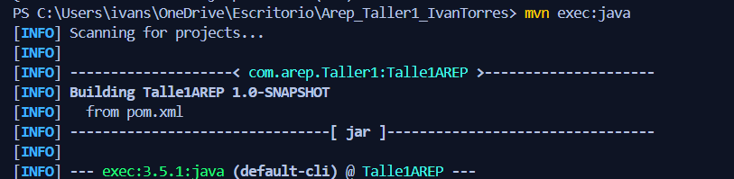
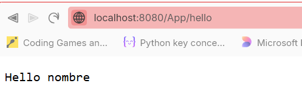
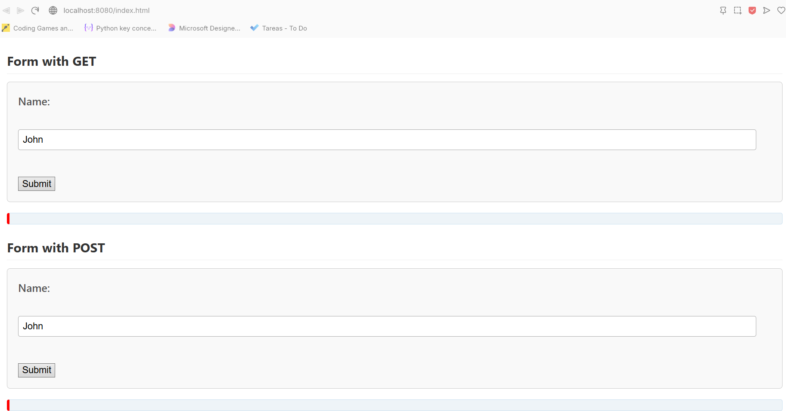
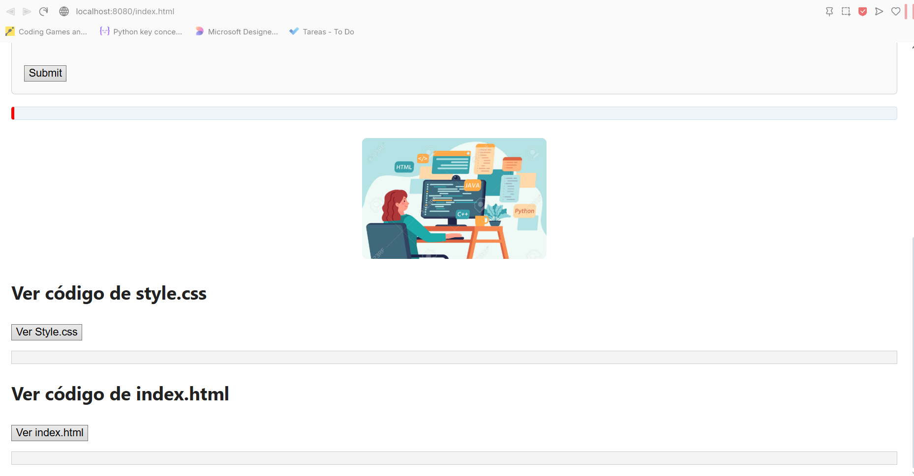
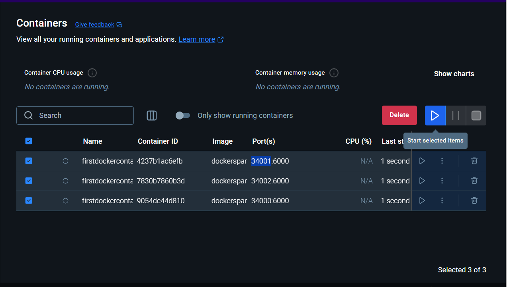
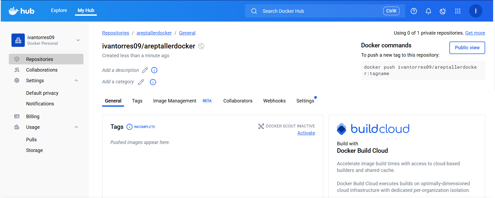
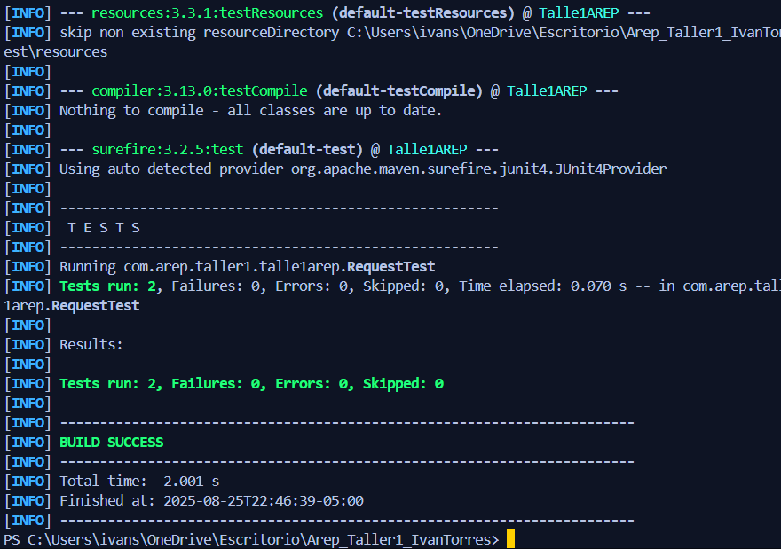

# Taller: Aplicación Web, Docker y Despliegue en AWS
# El video se encuentra en 

https://1drv.ms/f/c/a0a575a235eb8a36/Eu2IFyNDQ65DisncdS9pcjcBXHIIH-zls8u2oIIiX2pAvA?e=JeGcdv


- El taller consiste en crear una aplicación web pequeña usando Spring. Una vez    tengamos esta aplicación, construiremos un contenedor Docker para la app, lo desplegaremos y configuraremos en nuestra máquina local, subiremos la imagen a DockerHub y finalmente la desplegaremos en una máquina virtual de AWS.

## Arquitectura

El servidor está implementado en la clase principal `HttpServer.java` y funciona de la siguiente manera:

1. **Escucha en un puerto TCP (8080)** usando `ServerSocket` y acepta conexiones de clientes de forma secuencial (no concurrente).
2. **Procesa cada solicitud HTTP** leyendo la primera línea para identificar el método y la ruta solicitada.
3. **Manejo de archivos estáticos:**
    - Si la ruta corresponde a un archivo existente en `target/classes/webroot`, el servidor lee el archivo del disco y lo retorna con el tipo MIME adecuado (HTML, CSS, JS, imágenes, etc.).
4. **Manejo de servicios REST:**
    - Si la ruta solicitada corresponde a un endpoint especial (por ejemplo, `/hello`, `/hellopost`, `/app/hello`), el servidor ejecuta un método Java que genera la respuesta (texto o JSON), permitiendo la comunicación asíncrona desde el frontend.
5. **Frontend de prueba:**
    - La carpeta `public` contiene una aplicación web con HTML, CSS, JS e imágenes que permite probar tanto la carga de archivos estáticos como la invocación de servicios REST mediante AJAX/fetch.

El servidor no utiliza ningún framework web externo, solo clases estándar de Java (`ServerSocket`, `Files`, `PrintWriter`, etc.).

---

# Servidor web no concurrente
Este proyecto implementa un servidor web sencillo en **Java** que permite:
- Servir archivos estáticos como HTML, CSS, JS e imágenes.  
- Manejar solicitudes HTTP con los métodos **GET** y **POST**.  
- Responder a formularios desde el navegador. 

## Para comenzar
Estas instrucciones te permitirán obtener una copia del proyecto y ejecutarlo en tu máquina local para desarrollo y pruebas.  

### Prerequisites
Debes tener instalado en tu equipo:  

- [Java 17 o superior](https://adoptium.net/)  
- [Apache Maven](https://maven.apache.org/) 

Verifica las versiones:
-  java -version
-  mvn -version

### Instalación
Clona este repositorio en tu máquina:
```
git clone https://github.com/Ttowers-09/Taller_Modularizacion_Virtualizacion_Docker_AREP.git
```
Accedemos a la carpeta:
```
cd Taller_Modularizacion_Virtualizacion_Docker_AREP
```

## Ejecución (Solo consola)

Estando dentro de la carpeta Taller_Modularizacion_Virtualizacion_Docker_AREP ejecutamos el siguiente  comando:
```
java -cp target/classes com.arep.taller1.talle1arep.MicroSpringBoot
```


la consola se quedará esperando respuesta asi que nos dirigimos a nuestro browser y escribimos:
```
http://localhost:8080
```
aqui visualizaremos el mensaje "Hola".

Si queremos ver nuestro archivo index:
```
http://localhost:8080/index.html
```

## Ejecución (Con Maven)
Estando dentro de la carpeta Arep_Taller1_IvanTorres ejecutamos el siguiente  comando:
```
mvn clean install
```
Con esto aseguramos que la compilación se realice desde cero eliminando cualquier archivo de compilación anterior.
luego utilizamos:
```
mvn compile
```
Para ejecutar el código fuente del proyecto.
luego utilizamos:
```
mvn exec:java
```
Para ejecutar la clase principal con método main, se verá de la siguiente manera.



### Finalizar la ejecución

En la consola ejecutamos la combinación de teclas: 

```
Windows: Ctrl + C
Mac: Comando + C
```
## Prueba de funcionalidades:
-Cuando carga en el buscador se verá de la siguiente manera:


- Luego ejecutamos lo siguiente en nuestro buscador, deberiamos de ver la salida "Hello + {nombre}"
```
http://localhost:8080/App/hello?name=nombre
```


- Al ejecutar el siguiente valor deberiamos de ver el valor numérico del valor de PI
```
http://localhost:8080/App/pi
```


- Para visualizar los archivos estáticos, los cuales estan en la carpeta resources:
```
http://localhost:8080/index.html
```




- Para ejecutar el método GET podemos utilizar el cuadro para poder colocar cualquier nombre:


- Para ejecutar el método POST podemos utilizar el cuadro para poder colocar cualquier nombre:


- Podemos visualizar los archivos estaticos definiendolos en nuestras URL, de la siguiente manera:


además de eso, en el index podemos encontrar botones para ver los archivos:


## Arquitectura Backend:
- @RestController: presenta las clases que exponen los servicios web.
- @GetMapping: Métodos que involucran un GET.
- @RequestParam: Inyecta parámetros a las solicitudes de nuestro servidor.
- Servidor HTTP: Resuelve nuestros métodos get y post, además de eso presenta archivos estáticos en nuestro servidor.

## Endpoints de nuestro código:
- Método **Get** en la ruta **/** con respuesta **Hola AREP de Ivan**
- Método **Get** en la ruta **/greeting** con respuesta **Hola AREP**
- Método **Get** en la ruta **/greeting?name=Ivan** con respuesta **Hola Ivan**

- Método **Get** en la ruta **/App/hello?name=Ivan** con respuesta **Hola Ivan**
- Método **Get** en la ruta **/App/hello** con respuesta **Hola desconocido**
- Método **Get** en la ruta **/App/pi** con respuesta **3.141592653589793**
-

**Visibilidad de archivos estáticos:**
- http://localhost:8080/index.html: veremos el archivo index.html el cual contendrá los métodos Get, Post, visibilidad de código style.css e imagen.

- http://localhost:8080/style.css: Veremos el codigo Css de la página.

- http://localhost:8080/IMAGEN.jpg: Veremos una imagen estática igual a la que se encuentra en el index.html.
## Compilación y dependencias

Compila con **Java 17+**  
En tu `pom.xml` agrega:

```
    xml
    <properties>
    <project.build.sourceEncoding>UTF-8</project.build.sourceEncoding>
    <maven.compiler.source>17</maven.compiler.source>
    <maven.compiler.target>17</maven.compiler.target>
    </properties>
```
## Dependencias de Spring
```
<dependency>
  <groupId>org.springframework.boot</groupId>
  <artifactId>spring-boot-starter-web</artifactId>
  <version>3.3.3</version>
</dependency>
```
## Utilizamos el plugin para copiar las dependencias
```
<build>
  <plugins>
    <plugin>
      <groupId>org.apache.maven.plugins</groupId>
      <artifactId>maven-dependency-plugin</artifactId>
      <version>3.0.1</version>
      <executions>
        <execution>
          <id>copy-dependencies</id>
          <phase>package</phase>
          <goals>
            <goal>copy-dependencies</goal>
          </goals>
        </execution>
      </executions>
    </plugin>
  </plugins>
</build>
```

### Compilar proyecto
```
    mvn clean install
```
## Creamos el archivo dockerFile
```
FROM eclipse-temurin:17-jre

WORKDIR /usrapp/bin

ENV PORT 8080

COPY target/classes ./classes
COPY target/lib ./dependency

CMD ["java","-cp","./classes:./dependency/*","com.arep.taller1.talle1arep.MicroSpringBoot"]
```

## Creamos el archivo docker-compose.yml
```
version: '2'

services:
  web:
    build:
      context: .
      dockerfile: Dockerfile
    container_name: web
    ports:
      - "8087:8080"
    depends_on:
      - db

  db:
    image: mongo:3.6.1
    container_name: db
    volumes:
      - mongodb:/data/db
      - mongodb_config:/data/configdb
    ports:
      - "27017:27017"
    command: mongod

volumes:
  mongodb:
  mongodb_config:
```

# Ejecucion local y en Docker:
## Construimos la imagen de Docker a parrtir del docker file

## Verificamos la creacion de la imagen


## Accedemos a http://localhost:8087/index.html, http://localhost:8087/ y http://localhost:8087/hello

## Creamos los contenedores indiciduales
```
docker run -d -p 34000:8080 --name firstdockercontainer dockersparkprimer
docker run -d -p 34001:8080 --name firstdockercontainer2 dockersparkprimer
docker run -d -p 34002:8080 --name firstdockercontainer3 dockersparkprimer
```


## Los colocamos en funcionamiento


## En nuestro visual lo listamos para ver que efectivamente estan corriendo


## alternativa 2 para no ejecutarlo desde la interfaz grafica


## nos dirigimos a nuestro navegador y lo comprobamos con el RestController


## Construimos los servicios dataBase y Web
```
docker-compose build
docker-compose up
```


## Verificamos que se hallan creado correctamente

```
- verificamos el mapeo de puertos
-Comprobamos el servicio web que expone el puerto 8080 del contenedor al 8087 de la maquina
- Contenedor de DataBase
```

## Comprobamos en Docker Desktop


## Visualizamos en el navegador


# Subir la imagen a Docker Hub
## creamos el repositorio en este caso areptallerdocker


## Confirmamos que subimos dockersparkprimer


## Subimos la imagen a DockerHub
```
Le damos a la imagen el nombre requerido por Docker Hub: usuario/repositorio:tag
```


## realizamos login


## subimos la imagen a DockerHub


## Comprobamos en la UI de DockerHub


## Ejecutamos la imagen anteriormente creada


# Despliegue AWS
## Creamos la instancia de EC2 con los siguientes parametros


## Ahora en la carpeta de nuestro proyecto guardamos la llave privada y nos conectamos mediante ssh


## Actualizamos paquetes y librerias de nuestro sistema operativo en EC2


## Instalamos Docker


## Arrancamos el servicio


## agregamos el usuario de ec2 para no usar siempre sudo


## Clonamos nuestro repositorio


## nos coinectamos mediante la URL
```´
http://ec2-34-230-35-71.compute-1.amazonaws.com:8080/hello
```
## Probamos la URl

## Construido con:

- **Java Standard Library** - El proyecto está construido con clases de I/O y java.net de la librería estándar de Java.

- **Maven** - Se utiliza como herramienta de gestión de dependencias y compilación.


## Ejecutar los Test:
- Los test se encuentran en la carpeta: ../test/java/com/arep/taller1/talle1arep

- Para ejecutar los test utilizamos el siguiente comando:
```
mvn test
```



## Contribuir

En caso de querer contribuir envia una pull request especificando los cambios, en que afecta el código, el comportamiento del proyecto y su beneficio.

## Versionamiento

Usamos Git y GitHub para realizar el versionamiento del proyecto.

## Authors

* **Ivan Santiago Forero Torres** - *Trabajo inicial* - gitHub User: [Ttowers-09]


## Licencia

This project is licensed under the MIT License - see the [LICENSE.md](LICENSE.md) file for details

